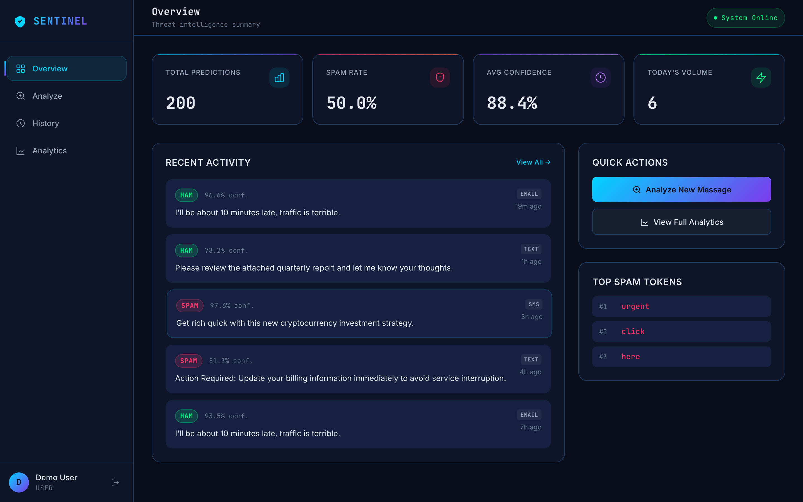
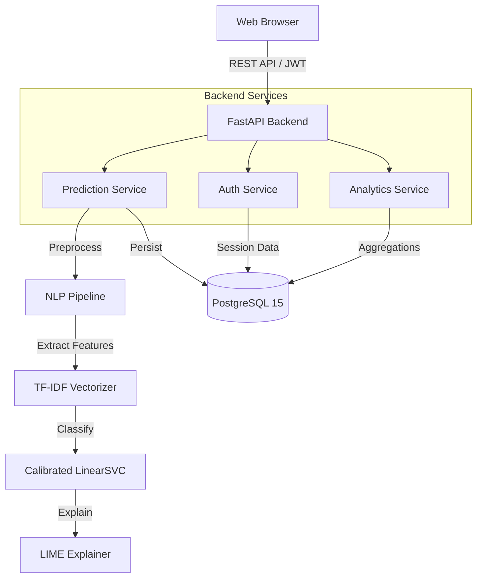
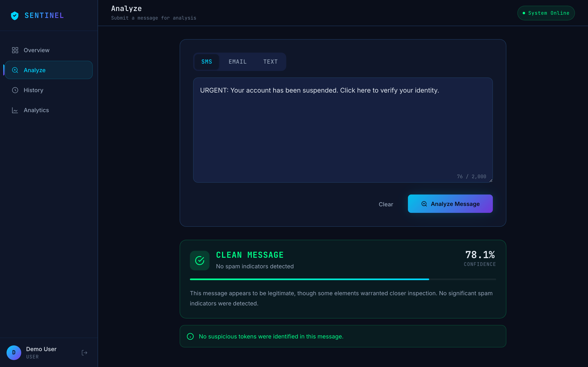
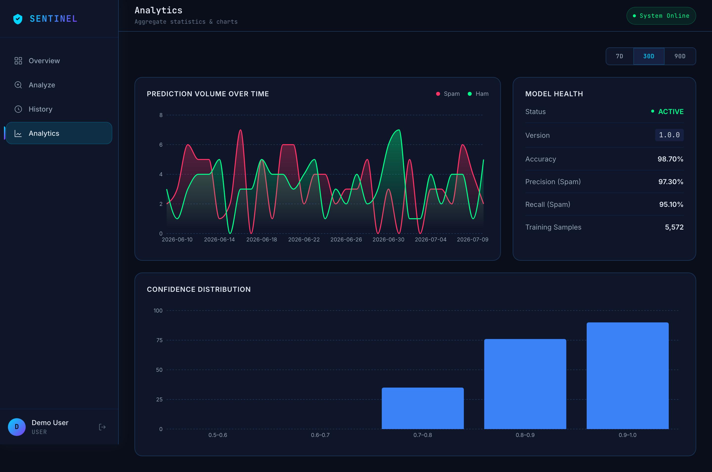

# SENTINEL

**AI-Powered Spam Detection & Threat Intelligence Platform**

[](#)
[](#)
[](#)
[](https://opensource.org/licenses/MIT)

SENTINEL is an enterprise-grade full-stack web application designed for intelligent spam detection and classification. Combining a modern Natural Language Processing (NLP) pipeline with a calibrated Machine Learning model, the system classifies SMS, email, and plain text messages as legitimate or malicious.

Unlike traditional black-box classifiers, SENTINEL utilizes [LIME (Local Interpretable Model-agnostic Explanations)](https://github.com/marcotcr/lime) to surface token-level attribution for every prediction, providing genuine insight into the model's reasoning.



For a comprehensive technical overview and onboarding guide, please see the [PROJECT_GUIDE.md](PROJECT_GUIDE.md).

---

## System Architecture



### Analysis & LIME Explanation
SENTINEL provides both high-level classification and detailed token-level explanations.


### Real-time Analytics
Keep track of prediction volume and spam confidence distributions across your organization.


---

## Documentation

Comprehensive documentation is available in the `docs/` directory:

- **[Architecture & Design](docs/architecture.md)**
- **[Machine Learning Pipeline](docs/machine-learning.md)**
- **[Backend Services](docs/backend.md)**
- **[Frontend Architecture](docs/frontend.md)**
- **[Database Schema](docs/database.md)**
- **[REST API Reference](docs/api.md)**
- **[Security Model](docs/security.md)**
- **[Testing Strategy](docs/testing.md)**
- **[Deployment Guide](docs/deployment.md)**
- **[Developer Guide](docs/developer-guide.md)**
- **[Engineering Decisions Log](docs/decisions.md)**

---

## Tech Stack

| Layer | Technology |
|-------|------------|
| **Frontend** | React 19, TypeScript, Vite, Zustand, TanStack Query, Framer Motion, Recharts |
| **Backend** | FastAPI (Python 3.11), Uvicorn |
| **Database** | PostgreSQL 15, SQLAlchemy 2.x (Async), Alembic, asyncpg |
| **ML & NLP** | scikit-learn, NLTK, joblib, LIME, emoji |
| **Security** | JWT (Dual-token), bcrypt, SlowAPI, CORS |
| **DevOps** | Docker, Docker Compose, GitHub Actions |

---

## Quickstart

### Prerequisites
- Python 3.11+
- Node.js 20+
- Docker + Docker Compose

### Starting the Application

The fastest way to spin up the application is via Docker Compose, which automatically builds the services and runs database migrations.

```bash
# 1. Clone the repository
git clone https://github.com/Ayush-o1/sentinel.git
cd sentinel

# 2. Configure environment
cp .env.example .env
# Edit .env and securely generate a SECRET_KEY
# python -c "import secrets; print(secrets.token_hex(32))"

# 3. Start services
docker-compose up --build
```

The application will be accessible at:
- **Frontend Dashboard:** `http://localhost:5173`
- **Backend API:** `http://localhost:8000`
- **Swagger Documentation:** `http://localhost:8000/docs`

For manual local setup without Docker, please refer to the [Developer Guide](docs/developer-guide.md).

---

## Contributing

We welcome contributions! Please see our [Contributing Guide](CONTRIBUTING.md) for details on how to set up your environment, run tests, and submit Pull Requests.

---

## License

This project is licensed under the MIT License. See the [LICENSE](LICENSE) file for details.
