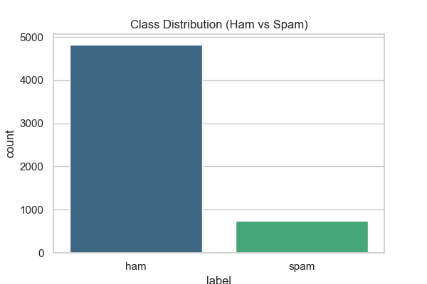
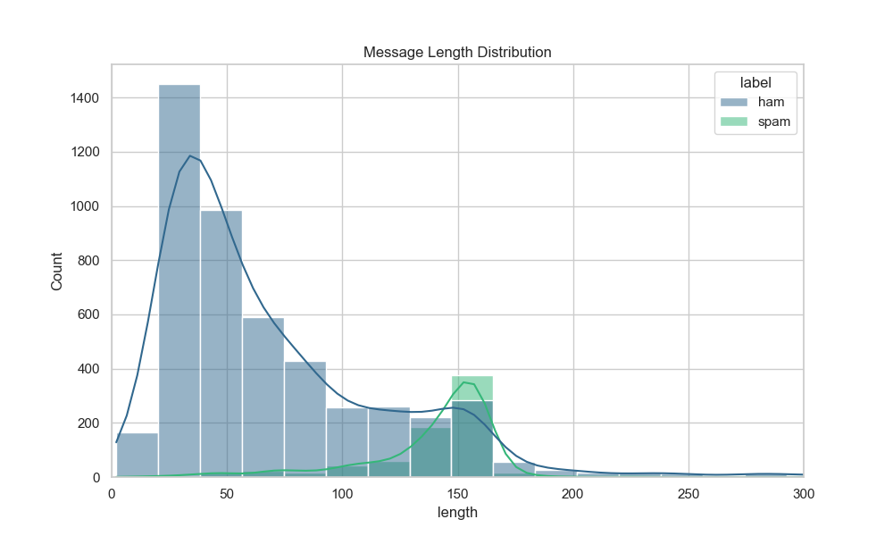
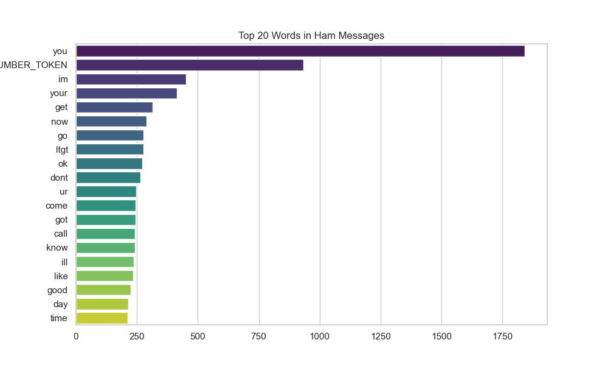
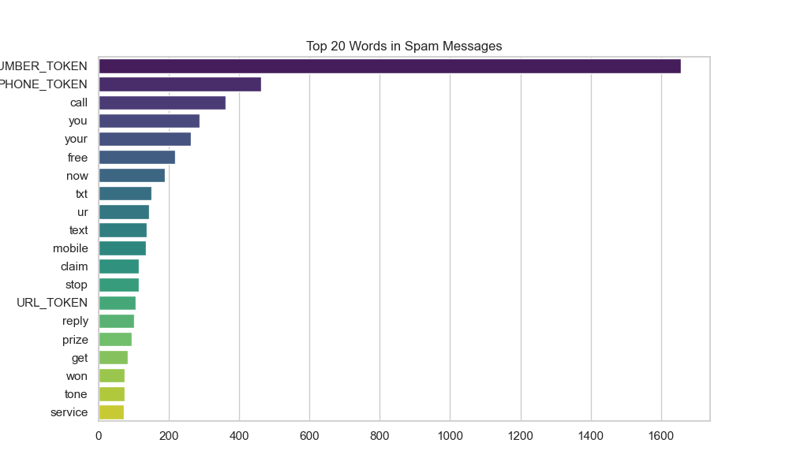

# SENTINEL Dataset Exploration Report

## Dataset Source
UCI SMS Spam Collection

## Summary Statistics
- **Total Messages**: 5572
- **Ham Messages**: 4825 (86.6%)
- **Spam Messages**: 747 (13.4%)
- **Spam vs Ham Ratio**: 1 : 6.46
- **Average Message Length**: 80.5 characters
  - **Average Ham Length**: 71.5 characters
  - **Average Spam Length**: 138.7 characters
- **Total Vocabulary Size**: 8216 unique tokens

## Visualizations

