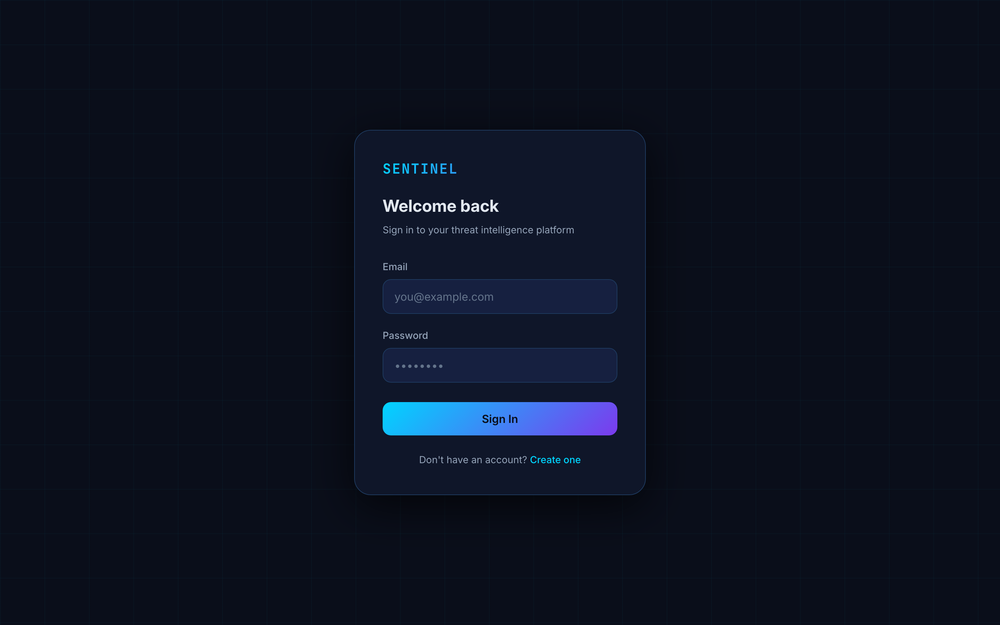

# Frontend Architecture

## Project Structure
The frontend is a React 19 application built using Vite and TypeScript. It uses a modern flat-domain folder structure inside `frontend/src`:
- `components/`: Reusable UI elements (Buttons, Inputs, Cards).
- `pages/`: Full-page views mapped to router paths (Dashboard, History, etc.).
- `store/`: Zustand global state slices.
- `services/`: API abstractions and Axios interceptors.
- `hooks/`: Custom React hooks (often wrapping TanStack Query).
- `utils/`: Formatting and helper functions.

## Routing
Routing is handled by `react-router-dom` v6. 
We utilize a `ProtectedRoute` wrapper component that inspects the Zustand authentication store. If a user is not authenticated, they are automatically redirected to `/login` with their intended destination captured in state.

## State Management
- **Zustand**: Handles globally persistent, but relatively static state (e.g., Auth State). It is lightweight and prevents prop-drilling.
- **TanStack Query (React Query)**: Handles all asynchronous server state. It caches API responses, automatically refetches in the background, and handles loading/error states gracefully.

## API Communication
The `services/api.ts` file exports a configured Axios instance.
Crucially, it contains interceptors that automatically:
1. Inject the in-memory Bearer token into the `Authorization` header.
2. Catch `401 Unauthorized` responses.
3. Pause all outgoing requests.
4. Hit the `/api/v1/auth/refresh` endpoint using the secure `HttpOnly` cookie.
5. Re-inject the new token and resume the paused requests seamlessly.

## Styling Philosophy
SENTINEL utilizes CSS Modules (`.module.css`) to prevent global namespace collisions. The styling emphasizes a dark, modern cybersecurity aesthetic using a unified set of CSS variables (`var(--color-bg-primary)`) defined in `index.css`. Framer Motion is used sparsely for micro-interactions and route transitions.
